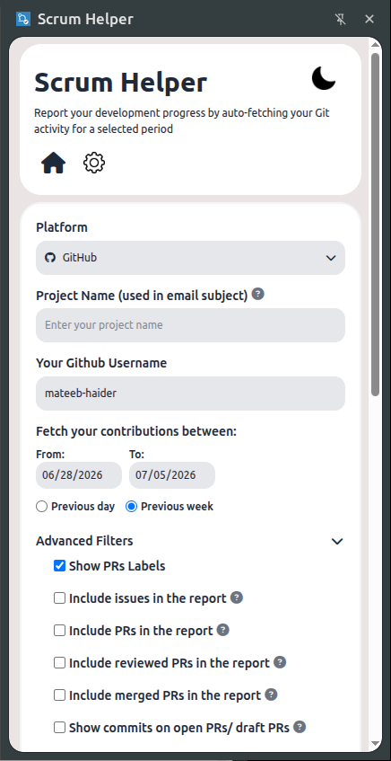
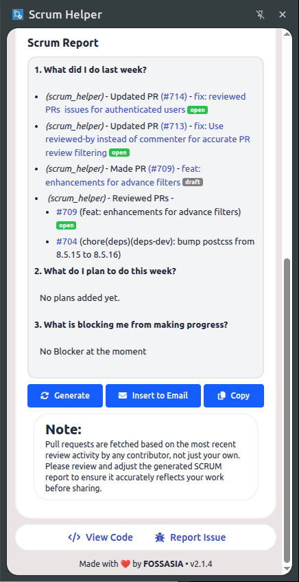
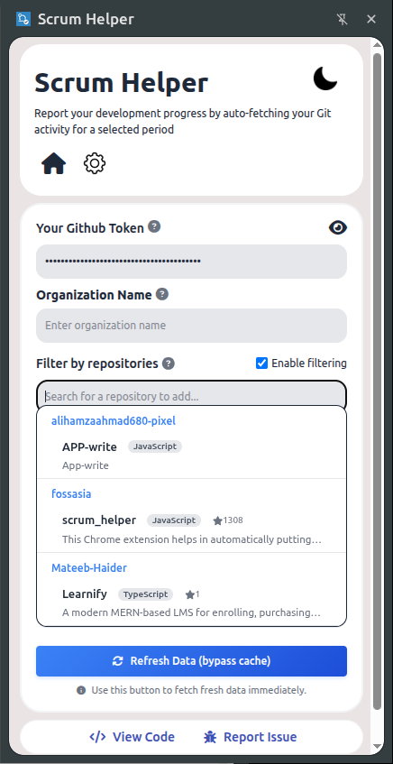
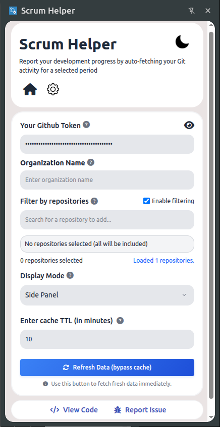
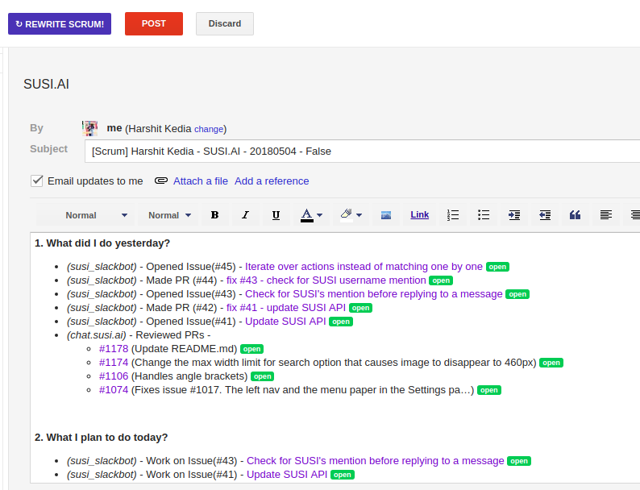

# Scrum Helper

**Scrum Helper** is a Chrome extension that simplifies writing development reports by auto-filling content based on your Git activity. Just enter your GitHub username, select a date range, and choose your preferences, the extension automatically fetches your commits, pull requests, issues, and code reviews via the GitHub API and generates a pre-filled report that you can edit as needed. While currently focused on Git-based workflows, Scrum Helper is designed to expand to other platforms in the future.


## Features

- Automatically fetches your Git activity, including commits, pull requests, issues, and code reviews.
- Currently supports GitHub, with plans to expand to other platforms
- Generates editable scrum updates based on your selected date range
- Integrates directly with compose windows in Google Groups, Gmail, Yahoo Mail, and Outlook

## How to install

### For Chrome:

1. Open the Chrome Web Store and search for [“Scrum Helper”](https://chromewebstore.google.com/detail/Scrum%20Helper/begjldpiiihpnaflcbdbbophiifphokg) by FOSSASIA.
2. Click “Add to Chrome”.
3. Pin the extension to your toolbar (optional).
4. Open the extension popup from your browser toolbar.
5. Set your GitHub username, date range, and preferences in the popup.
6. Start composing your reports in Gmail, Yahoo Mail, Outlook, or Google Groups using the extension.

## Setting Up Your Development Environment

1.  **Fork & Clone the Repository**

    ```sh
    git clone https://github.com/YOUR_USERNAME/scrum_helper.git
    cd scrum_helper
    ```

2.  **Install Dependencies**

    ```sh
    npm install
    ```

3.  **Build the Extension**

    Because Chromium (Chrome, Edge, etc.) and Gecko (Firefox) browsers handle Manifest V3 differently, we use a build step to generate engine-specific distributions.

    ```sh
    npm run build
    ```

4.  **Load the Extension in Your Browser**

    **For Chrome & Edge (Chromium):**
    -   Go to `chrome://extensions` (or `edge://extensions`) in your browser.
    -   Enable "Developer Mode" (toggle in the top-right).
    -   Click "Load unpacked" and select the `dist/chrome` folder inside the cloned repository.

    **For Firefox (Gecko):**
    -   Navigate to `about:debugging` in Firefox.
    -   Click on "This Firefox" in the left sidebar.
    -   Click "Load Temporary Add-on...".
    -   Select the `manifest.json` file inside the `dist/firefox` folder.
    -   *Note: The extension will remain active only for the current browser session. If you need persistence, consider using Firefox Developer Edition.*

## Usage

### For Google Groups:

- Open Google Groups New Topic
- Start a New Conversation
- Refresh the page to apply the Scrum Helper settings
- Use the pre-filled scrum and edit as needed

### For Gmail, Yahoo, and Outlook:

- Open the Compose window.
- Ensure the Scrum Helper settings are applied (follow step 6 above)
- The extension will prefill scrum content for you to edit

### New Features

1. **Standalone Popup Interface**
   - Generate reports directly from the extension popup
   - Live preview of the report before sending
   - Rich text formatting with clickable links
   - Copy report to clipboard with proper formatting

2.  **Advanced Repository Filtering**
    *   Select specific repositories to include in your report for a more focused summary.
    *   Easily search and manage your repository list directly within the popup.
    *   *Requires a GitHub personal access token (classic) to fetch your repositories.*

3.  **Include Commits on Existing PRs**
    *   Option to include recent commits made to pull requests that were opened *before* the selected date range.
    *   Provides a more detailed and accurate view of your work on long-running PRs.
    *   *Requires a GitHub personal access token (classic).*

4.  **Flexible Display Modes**
    *   Easily toggle the extension display mode between a traditional **Popup** and a persistent **Side Panel** in the settings.
    *   *Note: The older standard extension on/off toggle has been removed in favor of this UI flexibility.*

5.  **Smart Caching & Auto-Generation**
    *   **Auto-Load:** When you open the extension, it instantly restores your previously generated Scrum report if there is a healthy cache in memory.
    *   **Auto-Generate:** If there is no cached report available, the extension automatically calculates and generates a new report without requiring you to click anything.
    *   **Manual Refresh:** If the cache duration expires (defaults to 10 minutes), the auto-load stops, and you just need to click the "Generate" button yourself to fetch fresh data.

### Usage Standalone

- Click on `GENERATE` button to generate the scrum preview (if not auto-generated).
- Edit it in the window.
- Copy the rich HTML using the `COPY` button.

## Contributing

We welcome contributions from the community! Whether it's reporting a bug, suggesting a new feature, or writing code, your help is appreciated.

Please read our **[Contributing Guide](CONTRIBUTING.md)** to learn how you can get involved.

## License

This project is licensed under the LGPL-2.1 License - see the [LICENSE](LICENSE) file for details.

## Screenshots

| | |
|---|---|
|  |  |
|  |  |

| |
|---|
|  |

## Setting up the code locally

```
$ git clone https://github.com/fossasia/scrum_helper/
$ cd scrum_helper
$ npm install
```

1. **Install the Extension**

* For Chrome & Edge (Chromium): Load it into your browser through [Chrome Extension Developer Mode](https://developer.chrome.com/docs/extensions/mv3/getstarted/) using the `dist/chrome` folder.
* For Firefox: Load it as a temporary add-on through `about:debugging` using the `dist/firefox` folder.

2. **Rebuild the Extension**
   After making changes to the source code, rebuild the extension running `npm run build`.
   * For Chrome: Rebuild or reload the extension in your browser (`chrome://extensions` → Refresh your extension).
   * For Firefox: Reload the temporary add-on by going to `about:debugging` → "This Firefox" → Click "Reload" next to your extension.
   
3. **How to Obtain a GitHub Personal Access Token**

- To use Scrum Helper with authenticated requests (for higher rate limits and private repositories), you need a GitHub personal access token.

  #### Steps to Generate a Token

  1. **Go to GitHub Developer Settings:**  
     Visit [https://github.com/settings/tokens](https://github.com/settings/tokens) while logged in to your GitHub account.

  2. **Choose Token Type:**

  - Select **"Personal access tokens (classic)"**.

  3. **Generate a New Token:**

  - Click **"Generate new token"** and select **"Generate new token (classic)"** from the dropdown.
  - Give your token a descriptive name (e.g., "Scrum Helper Extension").
  - Set an expiration date if desired.

  4. **Create and Copy the Token:**

  - Click **"Generate token"** at the bottom.
  - **Copy the personal access token (classic)** and save it securely. You will not be able to see it again!

  5. **Paste the Token in Scrum Helper:**

  - Open the Scrum Helper extension popup.
  - Paste your classic token into the "GitHub Token" field.

  > **Keep your token secret!** Never share it or commit it to public repositories.

  **Why use a token?**  
  Classic GitHub tokens allow the extension to make authenticated requests, increasing your API rate limit and enabling access to private repositories if you grant those permissions.

## Release Process

This project uses a fully automated release process powered by GitHub Actions. Understanding this process is helpful for both maintainers and contributors.

The process is split into two parts:

### 1. Automated Release Drafting

This part runs every time a pull request is merged into the `master` branch.

1.  **PR Merge**: A contributor's pull request is reviewed and merged.
2.  **Drafting Workflow**: The "Release Drafter" workflow is triggered.
3.  **Versioning**: The workflow inspects the `release:*` label or PR title to determine the next semantic version.
4.  **Changelog Update**: The `CHANGELOG.md` file is automatically updated with the titles of the merged PRs.
5.  **Draft Creation**: A new draft release is created or updated in the [Releases](https://github.com/fossasia/scrum_helper/releases) section. This draft includes the new version tag and the updated changelog notes.

### 2. Manual Release Publishing

This part is performed manually by maintainers when it's time to publish a new version.

1.  **Verification**: A maintainer reviews the draft release to ensure it's accurate and complete.
2.  **Publishing**: The maintainer publishes the release from the GitHub UI.
3.  **Chrome Web Store Deployment**: Publishing the release triggers the "Publish to Chrome Web Store" workflow, which automatically packages the extension and uploads it for review.

### If you encounter any bugs, please report them at the [Issues page](https://github.com/fossasia/scrum_helper/issues).

## AI-Assisted Contributions Guidelines

This project is receiving an increasing number of AI-assisted contributions. While we welcome the productivity AI tools bring, we require all contributions to maintain our standards for quality, intentionality, and maintainability. To ensure a high signal-to-noise ratio in our repository, please adhere to the following guidelines.

### Expectations from Contributors

* **You must understand your code:** We expect human judgment to be the final filter. You take full responsibility for every line you submit.
* **You must be able to explain:** If asked by a maintainer, you should be able to explicitly explain what your change does, why it is necessary, and how it integrates with the rest of the codebase.
* **Code must be:** 
  * Thoroughly tested
  * Manually validated in a real browser environment
  * Aligned with our existing architecture and codebase patterns

### What We Do NOT Accept

* PRs submitted without a clear use case or a linked, pre-approved issue.
* AI-generated code pasted blindly without deep comprehension.
* Duplicate PRs or attempts at solving issues that are already being handled.
* Surface-level "fixes" (e.g., unprompted refactoring, nitpicks) without solid reasoning.
* Features or abstractions that increase overall complexity without delivering tangible user value.

### PR Requirements

* **Linked Issue:** Every PR (unless it is a trivial typo fix) must be linked to an existing issue.
* **Clear Description:** Provide a well-reasoned description detailing the problem and your solution. Do not paste AI-generated summaries of file diffs.
* **Existing Patterns:** Follow the established project conventions implicitly. 
* **Avoid Complexity:** Keep changes as minimal and focused as possible.

### AI Best Practices Table

| Area | Good Contribution | Poor Contribution |
| :--- | :--- | :--- |
| **Problem selection** | Solving a verified, pre-existing issue that you understand and ideally have encountered. | Submitting unrequested "improvements" or claiming random issues without a real-world use case. |
| **Understanding** | Using AI to learn the codebase or brainstorm approaches, then writing/refining the final logic yourself. | Over-delegating to AI; submitting logic that you cannot confidently explain or debug. |
| **Code quality** | Focused, minimal changes that address the exact problem efficiently. | Bloated PRs that introduce unnecessary code churn or rewrite entire blocks out of context. |
| **Architecture** | Conforming strictly to the established design patterns and utilities of the project. | Hallucinating new dependencies or forcing foreign paradigms into the codebase. |
| **Validation** | Manually compiling and verifying the extension works, and writing reliable tests. | Submitting code that has never been tested locally or fails basic linting. |
| **Maintainability** | The implemented solution is simpler for us to maintain than the problem it solves. | Adding excessive "clever" complexity that increases the maintainer's review burden. |
| **PR description** | Writing a clear, human-authored explanation of the *why* behind your changes. Including screenshots of your changes.| Pasting a generic, AI-generated summary of the modified files without context. |
| **AI usage** | Disclosing your use of generative tools and verifying that the output makes sense. | Failing to review AI output, resulting in regressions or confidently incorrect logic. |

### Maintainer Policy

* We reserve the right to close low-quality or fully automated PRs that fail to meet these guidelines without extensive review.
* PRs containing features not aligned with our current priorities or roadmap may be closed.
* Contributors are strongly encouraged to pick well-defined, triaged issues to ensure their time and effort result in a successful merge.


