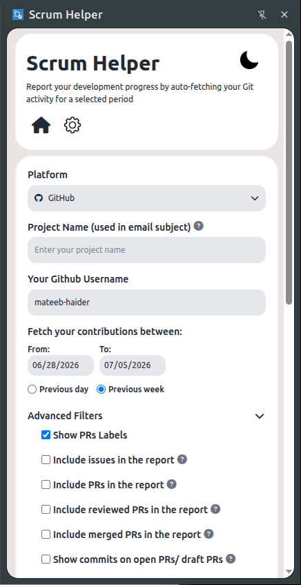
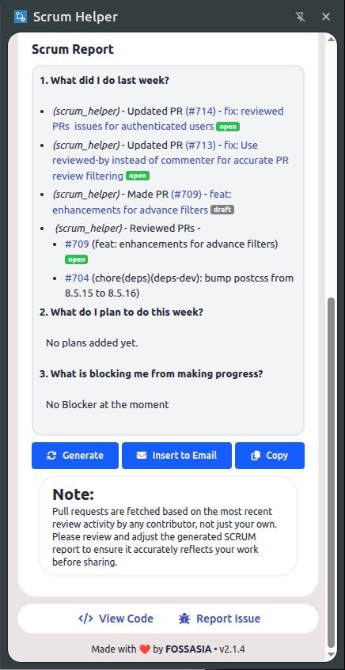
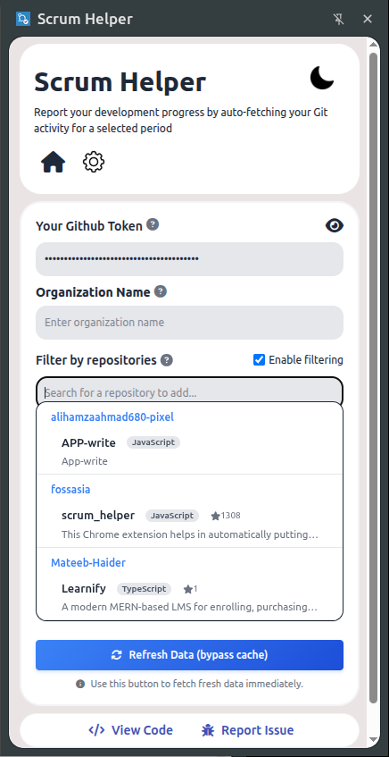
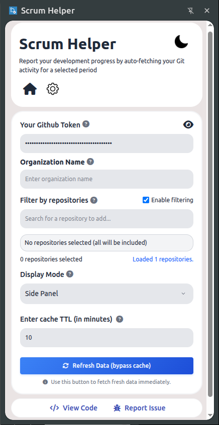
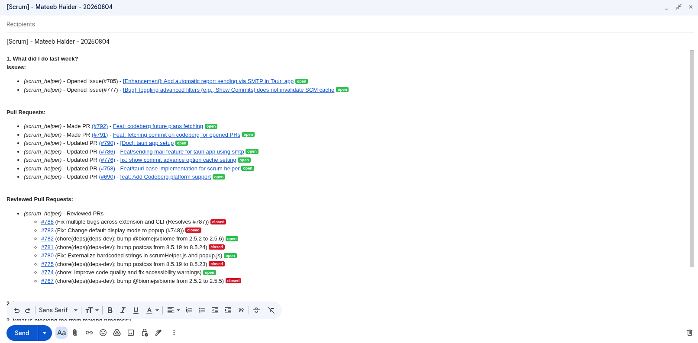

# Scrum Helper

> **Automated daily scrum and developer activity reporting across GitHub, GitLab, and Codeberg.**  
> Available as a native, ultra-lightweight standalone desktop application powered by **Tauri v2 & Rust** and as a companion browser extension for Chrome, Firefox, and Opera.

[](https://fossasia.github.io/scrum_helper/)
[](LICENSE)
[](https://chromewebstore.google.com/detail/Scrum%20Helper/begjldpiiihpnaflcbdbbophiifphokg)
[](https://addons.mozilla.org/en-US/firefox/addon/scrum-helper-by-fossasia/)
[](https://addons.opera.com/en/extensions/details/scrum-helper/)

---

### 🌐 Official Website & One-Click Downloads
Visit the official landing page for direct installer downloads, documentation, and live preview:  
👉 **[https://fossasia.github.io/scrum_helper/](https://fossasia.github.io/scrum_helper/)**

---


## Overview

**Scrum Helper** is an open-source FOSSASIA utility that eliminates the repetitive chore of manual daily standup and development reporting. Instead of digging through multiple repositories and browser tabs to remember what you worked on, Scrum Helper connects directly to your Git activity, pulling commits, pull requests, issues, and code reviews into a clean, editable 3-question scrum update.

Scrum Helper is available in two flexible formats:
1. **Native Tauri Desktop Application (Windows, macOS, Linux):** A standalone, distraction-free OS application built with **Rust and Tauri v2**. Consumes less than 25 MB RAM and compiles to a ~5 MB installer bundle without the bloat of Electron.
2. **Cross-Platform Browser Extensions (Chrome, Firefox, Opera):** Seamlessly integrates with your browser to prefill daily updates directly into webmail compose windows (**Gmail**, **Google Groups**, **Outlook**, and **Yahoo Mail**) or run in a handy popup / side panel.

---

## Key Features

- **Multi-VCS Activity Aggregation:** Native API connectors for **GitHub**, **GitLab**, and **Codeberg**. Aggregates commits, opened/merged pull requests, issues, and submitted code reviews across any custom date range.
- **Native Tauri Desktop App (Rust v2):** Blazing-fast desktop experience consuming **< 25 MB RAM** with a tiny **~5 MB installer**, replacing heavy 400 MB+ Electron desktop clients.
- **Standardized Daily Scrum Formatting:** Organizes activity into standard scrum sections:
  - **Done / What did you do yesterday?** Merged commits, submitted PRs, and completed reviews.
  - **Today / Next Plans:** Automatically aggregates open assigned issues and active PR work items.
  - **Blockers:** Dependencies, waiting reviews, or ongoing obstacles.
- **Next Plans & Assigned Issue Tracking:** Fetches your open assigned issues across repositories so your upcoming plan is always up to date.
- **1-Click Webmail Auto-Fill:** Automatically detects and populates compose windows in **Gmail**, **Google Groups**, **Outlook**, and **Yahoo Mail**.
- **Interactive In-App Editor:** Live preview and inline editing with clickable links before copying or emailing your report.
- **Advanced Repository Filtering:** Search and select specific repositories to focus reports on individual clients, projects, or sprints.
- **Include Commits on Existing PRs:** Optionally tracks recent commits pushed to long-running PRs created prior to the selected timeframe.
- **100% Privacy & Local Storage:** Zero external cloud servers, analytics, or telemetry. Personal access tokens and credentials remain strictly on your local device.
- **Universal Rich-Text Clipboard:** One-click copy with formatted HTML or Markdown for Slack, Microsoft Teams, Discord, Jira, or email.

---

## Screenshots

| Browser Extension Popup | Extension Detailed View |
| :---: | :---: |
|  |  |

| Standalone Desktop App (Tauri) | Settings & Authentication |
| :---: | :---: |
|  |  |

| Generated Scrum Report Preview |
| :---: |
|  |

---

## Download & Installation

### 1. Tauri Desktop Application (Windows, macOS, Linux)

Pre-built standalone installers are available directly from the [Scrum Helper Landing Page](https://fossasia.github.io/scrum_helper/#download) or [GitHub Releases](https://github.com/fossasia/scrum_helper/releases/latest):

| Operating System | Package Type | Direct Download Link |
| :--- | :--- | :--- |
| **Windows 10 / 11 (x64)** | Executable Setup (`.exe`) | [Download setup.exe](https://fossasia.github.io/scrum_helper/downloads/scrum-helper-setup.exe) |
| **Windows 10 / 11 (Enterprise)** | Windows Installer (`.msi`) | [Download x64.msi](https://fossasia.github.io/scrum_helper/downloads/scrum-helper-x64.msi) |
| **macOS (Apple Silicon)** | DMG Installer (`.dmg`) | [Download arm64.dmg](https://fossasia.github.io/scrum_helper/downloads/scrum-helper-arm64.dmg) |
| **macOS (Intel x64)** | DMG Installer (`.dmg`) | [Download x64.dmg](https://fossasia.github.io/scrum_helper/downloads/scrum-helper-x64.dmg) |
| **Linux (Ubuntu / Debian)** | Debian Package (`.deb`) | [Download .deb](https://fossasia.github.io/scrum_helper/downloads/scrum-helper.deb) |

### 2. Browser Extensions

Install Scrum Helper directly into your browser:

- **Chrome / Brave / Edge:** [Scrum Helper on Chrome Web Store](https://chromewebstore.google.com/detail/Scrum%20Helper/begjldpiiihpnaflcbdbbophiifphokg)
- **Firefox:** [Scrum Helper on Firefox Add-ons](https://addons.mozilla.org/en-US/firefox/addon/scrum-helper-by-fossasia/)
- **Opera:** [Scrum Helper on Opera Add-ons](https://addons.opera.com/en/extensions/details/scrum-helper/)

---

## Tauri Desktop App Architecture

The desktop edition of Scrum Helper is built using **Tauri v2**, pairing a lightweight **Rust** core with native operating system webview runtimes:
- **Windows:** Microsoft Edge WebView2
- **macOS:** Apple WebKit
- **Linux:** WebKitGTK (`webkit2gtk-4.1`)

### Why Tauri instead of Electron?
- **Ultra-Lightweight Memory Footprint:** Idles at **< 25 MB RAM**, compared to 300–600 MB typical of Electron applications.
- **Tiny Binary Footprint:** Full installers are only **~4–6 MB** rather than 100–150 MB+.
- **Hardened Security:** Strict Rust IPC boundaries ensure your Git tokens never leave your local environment.
- **Dedicated Standalone Window:** Keep your standup helper docked or open alongside terminal and IDE without taking up browser tabs.
- **Fast Startup:** Native OS rendering ensures instant launch with no cold-start lag.

---

## Setting Up Your Development Environment

1.  **Fork & Clone the Repository**

    ```sh
    git clone https://github.com/YOUR_USERNAME/scrum_helper.git
    cd scrum_helper
    ```

2.  **Install Dependencies**

    ```sh
    npm install
    ```

3.  **Build the Browser Extension**

    Because Chromium (Chrome, Edge, etc.) and Gecko (Firefox) browsers handle Manifest V3 differently, we use a build step to generate engine-specific distributions.

    ```sh
    npm run build
    ```

4.  **Load the Extension in Your Browser**

    **For Chrome, Edge & Brave (Chromium):**
    -   Go to `chrome://extensions` (or `edge://extensions` / `brave://extensions`) in your browser.
    -   Enable "Developer Mode" (toggle in the top-right).
    -   Click "Load unpacked" and select the `dist/chrome` folder inside the cloned repository.

    **For Firefox (Gecko):**
    -   Navigate to `about:debugging` in Firefox.
    -   Click on "This Firefox" in the left sidebar.
    -   Click "Load Temporary Add-on...".
    -   Select the `manifest.json` file inside the `dist/firefox` folder.
    -   *Note: The extension will remain active only for the current browser session. If you need persistence, consider using Firefox Developer Edition.*

    **For Opera:**
    -   Go to `opera://extensions` in Opera.
    -   Enable "Developer mode" (toggle in the top-right).
    -   Click "Load unpacked" and select the `dist/opera` folder inside the cloned repository.

5.  **Set Up & Run the Tauri Desktop App (Standalone Application)**

    If you are developing or building the desktop version of Scrum Helper:
    -   **Step 5.1: Install System Dependencies**
        Tauri requires system libraries to build the webview and Rust backend:

        *On Ubuntu/Debian:*

        ```sh
        sudo apt update
        sudo apt install -y libwebkit2gtk-4.1-dev build-essential curl wget file libxdo-dev libssl-dev libayatana-appindicator3-dev librsvg2-dev
        ```

        *On Windows or macOS:*
        Refer to the official [Tauri Prerequisites Guide](https://v2.tauri.app/start/prerequisites/) to install C++ build tools and platform-specific WebKit SDKs.

    -   **Step 5.2: Install Rust**
        Tauri requires the Rust toolchain:

        ```sh
        curl --proto '=https' --tlsv1.2 -sSf https://sh.rustup.rs | sh
        ```

        *(Note: Restart your shell after installation for cargo to load into your PATH environment).*

    -   **Step 5.3: Run in Development Mode**
        To run a hot-reloading development window of the desktop application:

        ```sh
        npm run tauri dev
        ```

    -   **Step 5.4: Build Standalone Production Binaries**
        To compile the final standalone installers (e.g. `.deb`, `.msi`, `.dmg`):
        ```sh
        npm run tauri build
        ```
        The compiled installers and binaries will be written to:
        `src-tauri/target/release/bundle/`

---

## Usage & Workflows

### Selecting a Platform
1. Open Scrum Helper (either the browser extension or the desktop application).
2. **Select your platform from the platform dropdown: GitHub, GitLab, or Codeberg.**
3. Enter your username; add authentication details when needed for private data or higher API limits.
4. **For GitLab, optionally provide a Group filter; leave it empty to include activity across all groups.**
5. **For Codeberg, optionally configure a custom API base URL.**
6. Select your desired date range and preferences.
7. Generate your scrum report.
8. Review and edit the generated report before using it in your preferred email, chat, or ticket platform.

### Standalone Desktop App Workflow:
- Launch Scrum Helper as a standalone window.
- Click `GENERATE` to fetch your recent activity (or allow smart auto-generation to pull automatically).
- Edit headings, items, and next plans directly in the live interactive preview.
- Click `COPY` to place rich HTML or formatted Markdown on your clipboard for Slack, Teams, or Jira.

### Webmail Auto-Fill (Browser Extension):
- **For Google Groups:** Open Google Groups New Topic, start a conversation, and refresh the page to apply Scrum Helper settings.
- **For Gmail, Yahoo, and Outlook:** Open the Compose window, and Scrum Helper will automatically prefill your formatted scrum content for final edits.

### Advanced Features & Productivity:

1. **Standalone Popup Interface:**
   - Generate reports directly from the extension popup.
   - Live preview of the report before sending.
   - Rich text formatting with clickable links.
   - Copy report to clipboard with proper formatting.

2. **Advanced Repository Filtering:**
   - Select specific repositories to include in your report for a more focused summary.
   - Easily search and manage your repository list directly within the popup.
   - *Requires a GitHub personal access token (classic) to fetch your repositories.*

3. **Include Commits on Existing PRs:**
   - Option to include recent commits made to pull requests that were opened *before* the selected date range.
   - Provides a more detailed and accurate view of your work on long-running PRs.
   - *Requires a GitHub personal access token (classic).*

4. **Flexible Display Modes:**
   - Easily toggle the extension display mode between a traditional **Popup** and a persistent **Side Panel** in the settings.

5. **Smart Caching & Auto-Generation:**
   - **Auto-Load:** When you open the extension or desktop app, it instantly restores your previously generated Scrum report if there is a healthy cache in memory.
   - **Auto-Generate:** If there is no cached report available, it automatically calculates and generates a new report without requiring you to click anything.
   - **Manual Refresh:** If the cache duration expires (defaults to 10 minutes), you can click the "Generate" button to fetch fresh data.

---

## Platform Setup and Authentication

Scrum Helper supports **GitHub, GitLab, and Codeberg**. Select your platform from the platform dropdown. A username is required; authentication tokens and optional filters/API URLs are only needed for private data, higher API limits, or token-gated features.

### GitHub

To use Scrum Helper with GitHub:

* Enter your **GitHub username**.
* Enter a **GitHub Personal Access Token (classic)**.
* The token can be used for authenticated API requests, higher API rate limits, and access to private repositories when the appropriate permissions are granted.

#### Creating a GitHub Personal Access Token (Classic)

1. Go to [GitHub Developer Settings](https://github.com/settings/tokens) while logged in to your GitHub account.
2. Select **Personal access tokens (classic)**.
3. Click **Generate new token** and select **Generate new token (classic)**.
4. Give the token a descriptive name and configure its expiration and required permissions.
5. Click **Generate token**.
6. Copy the token and store it securely. GitHub will not show the token again.
7. Enter the token in the GitHub token field in Scrum Helper.

> **Keep your token secret.** Never share it or commit it to a public repository.

### GitLab

To use Scrum Helper with GitLab:

* Enter your **GitLab username**.
* Enter a **GitLab Personal Access Token**.
* The token must have the **`read_api` scope**.
* Optionally enter a **Group filter** to limit the results to a specific GitLab group.

#### Creating a GitLab Personal Access Token

1. Open your GitLab account settings.
2. Navigate to **Access Tokens**.
3. Create a new Personal Access Token.
4. Give the token a descriptive name and set an expiration date if required.
5. Select the **`read_api`** scope.
6. Create the token and copy it securely.
7. Enter the token in Scrum Helper and optionally configure the Group filter to limit results to a GitLab group.

> **Keep your token secret.** Never share it or commit it to a public repository.

### Codeberg

To use Scrum Helper with Codeberg:

* Enter your **Codeberg username**.
* Enter your **Codeberg Access Token**.
* Optionally provide a **custom Codeberg API base URL**.
* The default API base URL is:  
  `https://codeberg.org/api/v1`

The custom API base URL allows Scrum Helper to work with custom or self-hosted Codeberg instances that provide a compatible API.

#### Creating a Codeberg Access Token

1. Log in to your Codeberg account.
2. Navigate to your account settings and open the **Applications** or access-token section.
3. Create a new access token.
4. Give the token a descriptive name and configure the required permissions.
5. Create the token and copy it securely.
6. Enter your username and access token in Scrum Helper.
7. If you are using the standard Codeberg service, leave the API base URL as:  
   `https://codeberg.org/api/v1`
8. If you are using a custom Codeberg instance, enter its API base URL in the API Base URL field.

> **Keep your token secret.** Never share it or commit it to a public repository.

---

## Release Process

This project uses a fully automated release process powered by GitHub Actions. Understanding this process is helpful for both maintainers and contributors.

The process is split into two parts:

### 1. Automated Release Drafting

This part runs every time a pull request is merged into the `master` branch.

1.  **PR Merge**: A contributor's pull request is reviewed and merged.
2.  **Drafting Workflow**: The "Release Drafter" workflow is triggered.
3.  **Versioning**: The workflow inspects the `release:*` label or PR title to determine the next semantic version.
4.  **Changelog Update**: The `CHANGELOG.md` file is automatically updated with the titles of the merged PRs.
5.  **Draft Creation**: A new draft release is created or updated in the [Releases](https://github.com/fossasia/scrum_helper/releases) section. This draft includes the new version tag and the updated changelog notes.

### 2. Manual Release Publishing

This part is performed manually by maintainers when it's time to publish a new version.

1.  **Verification**: A maintainer reviews the draft release to ensure it's accurate and complete.
2.  **Publishing**: The maintainer publishes the release from the GitHub UI.
3.  **Chrome Web Store Deployment**: Publishing the release triggers the "Publish to Chrome Web Store" workflow, which automatically packages the extension and uploads it for review.

> If you encounter any bugs, please report them at the [Issues page](https://github.com/fossasia/scrum_helper/issues).

---

## AI-Assisted Contributions Guidelines

This project is receiving an increasing number of AI-assisted contributions. While we welcome the productivity AI tools bring, we require all contributions to maintain our standards for quality, intentionality, and maintainability. To ensure a high signal-to-noise ratio in our repository, please adhere to the following guidelines.

### Expectations from Contributors

* **You must understand your code:** We expect human judgment to be the final filter. You take full responsibility for every line you submit.
* **You must be able to explain:** If asked by a maintainer, you should be able to explicitly explain what your change does, why it is necessary, and how it integrates with the rest of the codebase.
* **Code must be:** 
  * Thoroughly tested
  * Manually validated in a real browser environment
  * Aligned with our existing architecture and codebase patterns

### What We Do NOT Accept

* PRs submitted without a clear use case or a linked, pre-approved issue.
* AI-generated code pasted blindly without deep comprehension.
* Duplicate PRs or attempts at solving issues that are already being handled.
* Surface-level "fixes" (e.g., unprompted refactoring, nitpicks) without solid reasoning.
* Features or abstractions that increase overall complexity without delivering tangible user value.

### PR Requirements

* **Linked Issue:** Every PR (unless it is a trivial typo fix) must be linked to an existing issue.
* **Clear Description:** Provide a well-reasoned description detailing the problem and your solution. Do not paste AI-generated summaries of file diffs.
* **Existing Patterns:** Follow the established project conventions implicitly. 
* **Avoid Complexity:** Keep changes as minimal and focused as possible.

### AI Best Practices Table

| Area | Good Contribution | Poor Contribution |
| :--- | :--- | :--- |
| **Problem selection** | Solving a verified, pre-existing issue that you understand and ideally have encountered. | Submitting unrequested "improvements" or claiming random issues without a real-world use case. |
| **Understanding** | Using AI to learn the codebase or brainstorm approaches, then writing/refining the final logic yourself. | Over-delegating to AI; submitting logic that you cannot confidently explain or debug. |
| **Code quality** | Focused, minimal changes that address the exact problem efficiently. | Bloated PRs that introduce unnecessary code churn or rewrite entire blocks out of context. |
| **Architecture** | Conforming strictly to the established design patterns and utilities of the project. | Hallucinating new dependencies or forcing foreign paradigms into the codebase. |
| **Validation** | Manually compiling and verifying the extension works, and writing reliable tests. | Submitting code that has never been tested locally or fails basic linting. |
| **Maintainability** | The implemented solution is simpler for us to maintain than the problem it solves. | Adding excessive "clever" complexity that increases the maintainer's review burden. |
| **PR description** | Writing a clear, human-authored explanation of the *why* behind your changes. Including screenshots of your changes. | Pasting a generic, AI-generated summary of the modified files without context. |
| **AI usage** | Disclosing your use of generative tools and verifying that the output makes sense. | Failing to review AI output, resulting in regressions or confidently incorrect logic. |

### Maintainer Policy

* We reserve the right to close low-quality or fully automated PRs that fail to meet these guidelines without extensive review.
* PRs containing features not aligned with our current priorities or roadmap may be closed.
* Contributors are strongly encouraged to pick well-defined, triaged issues to ensure their time and effort result in a successful merge.

---

## Contributing

We welcome contributions from the community! Whether it's reporting a bug, suggesting a new feature, or writing code, your help is appreciated.

Please read our **[Contributing Guide](CONTRIBUTING.md)** to learn how you can get involved.

---

## License

This project is licensed under the LGPL-2.1 License - see the [LICENSE](LICENSE) file for details.
