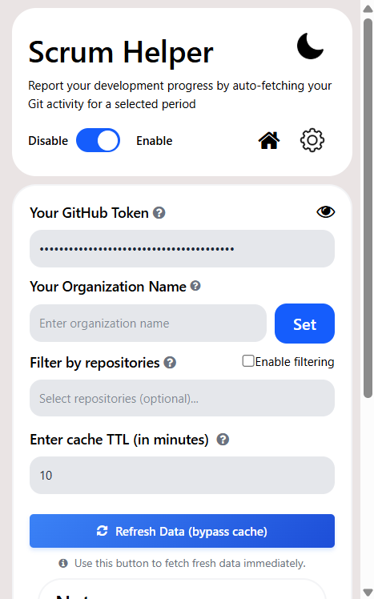

# Scrum Helper

**Scrum Helper** is a Chrome extension that simplifies writing development reports by auto-filling content based on your Git activity. Just enter your GitHub username, select a date range, and choose your preferences, the extension automatically fetches your commits, pull requests, issues, and code reviews via the GitHub API and generates a pre-filled report that you can edit as needed. While currently focused on Git-based workflows, Scrum Helper is designed to expand to other platforms in the future.


## Features

- Automatically fetches your Git activity, including commits, pull requests, issues, and code reviews.
- Currently supports GitHub, with plans to expand to other platforms
- Generates editable scrum updates based on your selected date range
- Integrates directly with compose windows in Google Groups, Gmail, Yahoo Mail, and Outlook

## How to install

### For Chrome:

1. Open the Chrome Web Store and search for [“Scrum Helper”](https://chromewebstore.google.com/detail/Scrum%20Helper/begjldpiiihpnaflcbdbbophiifphokg) by FOSSASIA.
2. Click “Add to Chrome”.
3. Pin the extension to your toolbar (optional).
4. Open the extension popup and set your GitHub username, date range, and preferences.

## Setting Up Your Development Environment

1.  **Fork & Clone the Repository**

    ```sh
    git clone https://github.com/YOUR_USERNAME/scrum-helper.git
    cd scrum-helper
    ```

2.  **Install Dependencies**

    ```sh
    npm install
    ```

3.  **Load the Extension in Your Browser**

    -   Go to `chrome://extensions` in your Chrome browser.
    -   Enable "Developer Mode" (toggle in the top-right).
    -   Click "Load unpacked" and select the `src` folder inside the cloned repository.

<!-- ### For Firefox:

1. Clone this repository to your local machine.
2. Open Firefox and navigate to `about:debugging`
3. Click on "This Firefox" in the left sidebar
4. Click "Load Temporary Add-on..."
5. Navigate to the `src` folder inside the cloned repo and select the `manifest.json` file
6. The extension will be loaded temporarily and will remain active only for the current browser session
7. Click the Scrum Helper icon on your browser toolbar
8. Fill in your settings in the popup (GitHub username, date range, etc.)

**Note for Firefox users:** The extension will be automatically removed when you close Firefox. You'll need to reload it each time you start a new browser session by repeating steps 2-5.

**Persistence Note:** If you need the extension to persist between sessions, use Firefox Developer Edition. You can enable persistence by setting `xpinstall.signatures.required` to `false` in the browser's configuration. -->

## Usage

### For Google Groups:

- Open Google Groups New Topic
- Start a New Conversation
- Refresh the page to apply the Scrum Helper settings
- Use the pre-filled scrum and edit as needed

### For Gmail, Yahoo, and Outlook:

- Open the Compose window.
- Ensure the Scrum Helper settings are applied (follow step 6 above)
- The extension will prefill scrum content for you to edit

### New Features

1. **Standalone Popup Interface**
   - Generate reports directly from the extension popup
   - Live preview of the report before sending
   - Rich text formatting with clickable links
   - Copy report to clipboard with proper formatting

2.  **Advanced Repository Filtering**
    *   Select specific repositories to include in your report for a more focused summary.
    *   Easily search and manage your repository list directly within the popup.
    *   *Requires a GitHub token to fetch your repositories.*

3.  **Include Commits on Existing PRs**
    *   Option to include recent commits made to pull requests that were opened *before* the selected date range.
    *   Provides a more detailed and accurate view of your work on long-running PRs.
    *   *Requires a GitHub token.*

### Usage Standalone

- Click on `GENERATE` button to generate the scrum preview.
- Edit it in the window.
- Copy the rich HTML using the `COPY` button.

## Contributing

We welcome contributions from the community! Whether it's reporting a bug, suggesting a new feature, or writing code, your help is appreciated.

Please read our **[Contributing Guide](CONTRIBUTING.md)** to learn how you can get involved.

## License

This project is licensed under the LGPL-2.1 License - see the [LICENSE](LICENSE) file for details.

## Screenshots

| | |
|---|---|
|  |  |
|  |  |

| |
|---|
|  |

## Setting up the code locally

```
$ git clone https://github.com/fossasia/scrum_helper/
$ cd scrum_helper
$ npm install
```

1. **Install the Extension**


* For Chrome: Load it into your browser through [Chrome Extension Developer Mode](https://developer.chrome.com/docs/extensions/mv3/getstarted/).
<!-- * For Firefox: Load it as a temporary add-on through `about:debugging` as described above. -->


2. **Build the Extension**
   * For Chrome: Rebuild or reload the extension in your browser (`chrome://extensions` → Refresh your extension).
   <!-- * For Firefox: Reload the temporary add-on by going to `about:debugging` → "This Firefox" → Click "Reload" next to your extension. -->
   
3. **How to Obtain a GitHub Personal Access Token**


- To use Scrum Helper with authenticated requests (for higher rate limits and private repositories), you need a GitHub personal access token.

  #### Steps to Generate a Token

  1. **Go to GitHub Developer Settings:**  
     Visit [https://github.com/settings/tokens](https://github.com/settings/tokens) while logged in to your GitHub account.

  2. **Choose Token Type:**

  - Select **"Personal access tokens (classic)"**.

  3. **Generate a New Token:**

  - Click **"Generate new token"**.
  - Give your token a descriptive name (e.g., "Scrum Helper Extension").
  - Set an expiration date if desired.

  4. **Create and Copy the Token:**

  - Click **"Generate token"** at the bottom.
  - **Copy the token** and save it securely. You will not be able to see it again!

  5. **Paste the Token in Scrum Helper:**

  - Open the Scrum Helper extension popup.
  - Paste your token into the "GitHub Token" field.

  > **Keep your token secret!** Never share it or commit it to public repositories.

  **Why use a token?**  
  GitHub tokens allow the extension to make authenticated requests, increasing your API rate limit and enabling access to private repositories if you grant those permissions.


## Release Process

This project uses a fully automated release process powered by GitHub Actions. Understanding this process is helpful for both maintainers and contributors.

The process is split into two parts:

### 1. Automated Release Drafting

This part runs every time a pull request is merged into the `master` branch.

1.  **PR Merge**: A contributor's pull request is reviewed and merged.
2.  **Drafting Workflow**: The "Release Drafter" workflow is triggered.
3.  **Versioning**: The workflow inspects the `release:*` label or PR title to determine the next semantic version.
4.  **Changelog Update**: The `CHANGELOG.md` file is automatically updated with the titles of the merged PRs.
5.  **Draft Creation**: A new draft release is created or updated in the [Releases](https://github.com/fossasia/scrum-helper/releases) section. This draft includes the new version tag and the updated changelog notes.

### 2. Manual Release Publishing

This part is performed manually by maintainers when it's time to publish a new version.

1.  **Verification**: A maintainer reviews the draft release to ensure it's accurate and complete.
2.  **Publishing**: The maintainer publishes the release from the GitHub UI.
3.  **Chrome Web Store Deployment**: Publishing the release triggers the "Publish to Chrome Web Store" workflow, which automatically packages the extension and uploads it for review.


### If you encounter any bugs, please report them at the [Issues page](https://github.com/fossasia/scrum_helper/issues).
